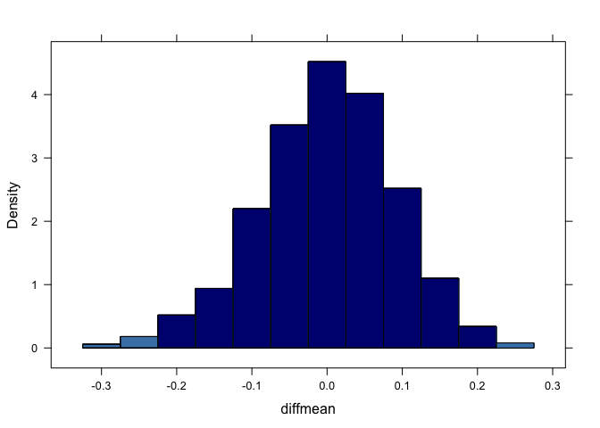

<!-- README.md is generated from README.Rmd. Please edit that file -->


ISIwithR
=======

This R Companion to 
[Introduction to Statistical Investigations (Preliminary Edition)](http:://www.hope.edu/isi/) 
by Nathan Tintle *et al*
provides

 * a companion text demonstrating how to use R to perform the analyses in that book
 * an R package (`ISIwithR`) 

## Companion Text

 The campanion text is available as a PDF 
 [[to view]](Book/ISIwithR.pdf) or [[to download]](../../raw/master/Book/ISIwithR.pdf) 
 
  * The authors are Randall Pruim and Lana Park.  
 
## R Package

The `ISIwithR` package can be installed from github using


```r
devtools::install_github("rpruim/ISIwithR")
```

This package contains 

  * all of the data sets used in the book, and 
  * the `isa_snippet()` function which can be used to run any of 
463 code chunks from the campanion.  

For example:


```r
require(ISIwithR)
require(mosaic)
```

```r
isi_snippet("Exploration6.3.8")
#> 
#> 
#> 	isa_snippet(Exploration6.3.8)
#> 	------ ~~~~~~~~~~~~~~~~
#> 
#> > sim.fri <- do(1000) * diffmean(friends ~ shuffle(sex), data = CloseFriends)
#> 
#> > head(sim.fri, 3)
#>      diffmean
#> 1 -0.10338310
#> 2  0.01525667
#> 3 -0.06751526
#> 
#> > histogram(~ diffmean, data = sim.fri, width = 0.05,
#> +         group = cut(diffmean, c(-0.4, -0.228, 0.228, 0.4)), 
#> +         fcol = c("steelblue", "navy", "steelblue"))
```

 

